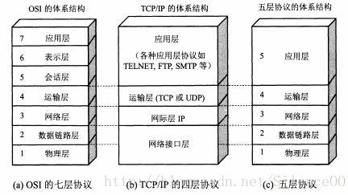
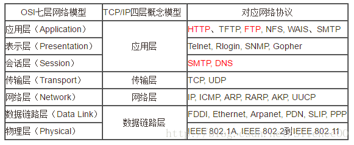
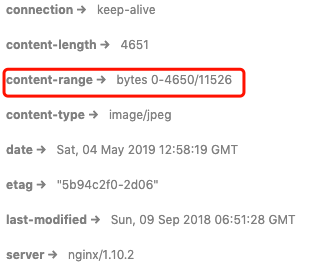
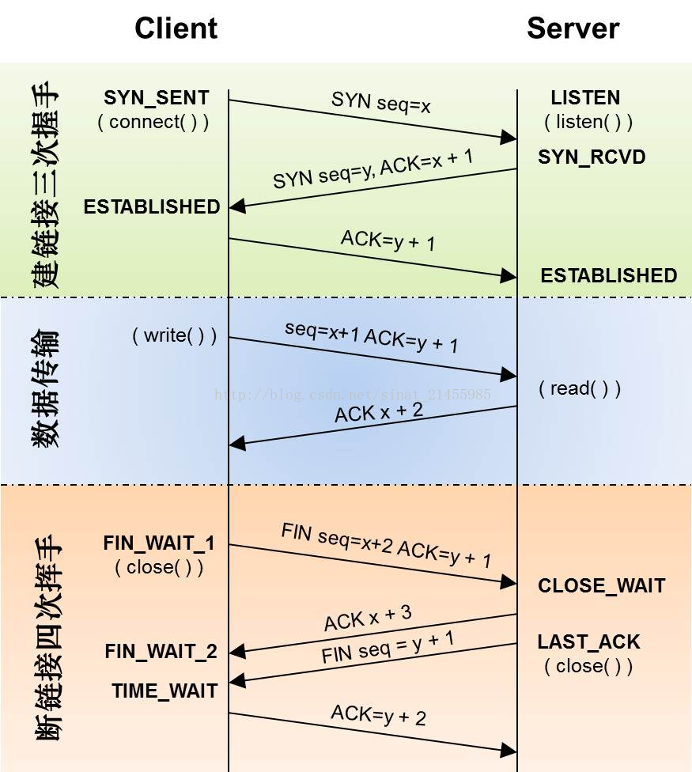

# protocols

http协议分层有3种模型

 

各种协议在各层之间的分布如下图

 

我们这里只关注如下几种协议

## http

+  http协议位于应用层

+ http协议是无连接协议。无连接的含义是限制每次连接只处理一个请求。服务器处理完客户的请求，并收到客户的应答后，即断开连接。采用这种方式可以节省传输时间

+ http协议是无状态协议。无状态的含义是每次传输没有记忆能力，如果本次连接用到了之前连接时传输的内容，则需要重传，在服务器不需要先前信息时它的应答就较快。后来人们用`cookie/session`等机制解决了无状态的问题

+ 示例

  ```http
  POST /winnCandidaController/saveOrUpdate HTTP/1.1
  Host: localhost:2000
  Content-Type: application/json
  X-Auth-Token: 1e53bd1bcf2c4f3c9a8984648dd00828
  
  {
  	"entrySubcontractNumber":"entrySubcontractNumber",
  	"projectCode":"projectCode",
  	"recommendedOneUnit":"recommendedOneUnit",
  	"winningAmountOne":"4",
  	"amountUnitOne":"recommendedOneUnit",
  	"recommendedSecondUnit":"recommendedOneUnit",
  	"winningAmountTwo":"2",
  	"amountUnitTwo":"recommendedOneUnit",
  	"recommendedSecondThree":"recommendedOneUnit",
  	"winningAmountThree":"3",
  	"amountUnitThree":"recommendedOneUnit",
  	"bidEvaluationCommitteeList":"recommendedOneUnit",
  	"publicityName":"recommendedOneUnit",
  	"publicityStartTime":"2019-03-19",
  	"publicityEndTime":"2019-03-29",
  	"remarks":"remarks"
  }
  ```

### 持久连接

+ 在`HTTP 1.1`中，所有连接默认都是持久连接，即`Connections`请求头为`keep-alive`

+ 在请求1个包含多张图片的html时，请求到html后，还需要请求那些图片，如果每次请求都需要建立和断开连接，则增加了很多额外的开销

+ 所以在`HTTP 1.1`中，默认都采用持久连接，即建立连接后如果没有明确需要断开连接，则一直保持连接，这个过程中可以请求多个资源，而不需要重新建立连接

+ 管线化

  `HTTP 1.1`中，可以同时发送多个请求，不需要等第一个请求响应后在发送第2个请求

### 范围请求

+ 范围请求是指：当需要下载1个文件时，为了保证不会因为中断而需要重新开始下载，可以每次请求下载一部分，多次请求将整个文件下载下来

+ 实现该功能，需要使用`Range`请求头来指定本次请求的范围

  ```http
  GET /%E4%B8%AA.jpg HTTP/1.1
  Host: disk.bymyse.club
  Range: bytes=0-5000
  ```

  响应中会返回`Content-Range`头，来标记本次响应的范围和文件总大小

    

### 状态码

+ 2xx 成功

  + 200

    请求被正常处理

  + 204

    资源没有发生变化

  + 206

    范围请求时响应的状态码

+ 3xx 重定向

  + 301

    永久重定向

  + 302

    临时重定向

+ 4xx 客户端错误

  + 400

    请求存在语法错误，服务端无法理解

  + 401

    未授权

  + 403

    不允许访问，比如出现跨域限制

  + 404

    未找到资源

+ 5xx 服务器错误

  + 500

    服务端内部错误

  + 503

    服务端正忙或正在维护

## DNS

+ DNS服务位于应用层
+ DNS服务全称为`Domain Name System`
+ DNS服务的作用是提供域名到IP地址之间的解析服务

## TCP

+ TCP协议位于传输层

+ TCP全称为`Transmission Control Protocol`，传输控制协议

### 作用及原理

+ TCP协议被叫做：确保可靠的字节流服务

  + 字节流服务

    TCP协议为了传输大数据，将数据分割为以`报文段`为单位的数据包，分开进行传输

    在分割时会为每个数据包打上`标记序号及端口`

  + 确保可靠

    TCP协议能够确认数据最终是否送达给对方

+ TCP接受到应用层数据后，经过了如下处理

  + 将数据拆分，并打上标记序号

  + 使用`3次握手`策略建立连接

  + 传输数据

    ​    将每个数据包发送给目标，同时携带`SYN`标志位，目标接收到数据后进行响应并返回`ACK`标志位

    ​    如果接收到目标的响应，则认为这个数据包传输成功，如果一定时间内没有收到响应，则认为传输失败，进行重传

    ​    超时时间一般使用算法决定；重传次数一般为3次，但有些要求较高的业务系统会重传很多次

  + 使用`4次挥手`策略断开连接

   

### 3次握手

+ 3次握手策略位于建立连接的阶段

+ 过程

  + 第1次握手

    客户端向服务端发送1个数据包，并携带`SYN`标志位

  + 第2次握手

    ​    服务端接收到客户端的数据包时，服务端可以确定：服务端可以接收到客户端发来的数据

    ​    服务端接收到数据包后，向客户端返回1个数据包，携带自己生成的`SYN`标志位，并将收到的`SYN`标志位的值+1后作为`ACK`标志位的值返回给客户端

  + 第3次握手

    ​    客户端接收到服务端发来的数据包时，客户端可以确定

    + 服务端可以接受到客户端的数据
    + 客户端可以接收到服务端的数据

    ​    但此时，服务端只能确定自己可以接收到客户端的数据，并不确定客户端能否接收到服务端发给客户端的数据，所以需要第3次握手，来让服务端确定这件事

    ​    客户端接收到数据包后，向服务端返回1个数据包，将收到的`SYN`标志位的值+1后作为`ACK`标志位的值返回服务端

    ​    服务端接收到客户端的数据包时，服务端就可以确认，自己可以向客户端收发数据了

### 4次挥手

+ 4次挥手策略位于断开连接阶段

+ TCP连接属于全双工通信，一方发送完数据后，可能另外一方还需要发送数据，如果断开连接使用3次挥手，则双方必须同时断开连接，这样会降低效率，所以需要采用4次挥手，保证双方可以分时断开连接

+ 过程

  + 第1次挥手

    当其中一方发送完数据后，需要断开他发送数据的连接时，向另一方发送1个数据包，携带`SYN`标志位

  + 第2次挥手

    另一方接收到该数据包后，就知道它无需再接收数据了

    它会返回1个数据包，并将接收到的`SYN`标志位+1后作为`ACK`标志位一起返回

  + 第3次挥手

    当另外一方也发送完数据后，需要断开他发送数据的连接时，也发送1个数据包，携带`SYN`标志位

  + 第4次挥手

    接收方接收到该数据包后，就知道它无需再接收数据了

    它会返回1个数据包，并将接收到的`SYN`标志位+1后作为`ACK`标志位一起返回

    发送方接收到返回的数据包后，则整个TCP连接彻底断开

## UDP

+ UDP协议位于传输层

+ UDP全称为`User Data Protocol`，用户数据包协议

## IP

+ IP协议位于网络层
+ IP协议全称为`Internet Protocol`
+ IP协议是1种协议，与`IP地址`没有关系

### 作用及原理

+ IP协议的作用是将数据传输给对方，而实现该功能，需要IP地址和MAC地址
+ 网络中的双方是需要多台设备进行中转才能将数据传输给对方的，而在中转时，需要知道下一台设备的MAC地址才能将数据传输给下一台设备。传输层将数据交给网络层时，是知道目标IP地址的，此时需要通过`ARP协议`将IP地址转化为MAC地址，而由于网络中数据传输需要经过`多次`中转才能将数据传输给目标，所以`ARP协议`也只能将IP地址转化为1个模糊的MAC地址，也就是下一台中转设备的MAC地址，如此往复经过多次中转，数据才能被送往目标地址

## https


## 通信数据转发程序

### 代理


### 网关


### 隧道


